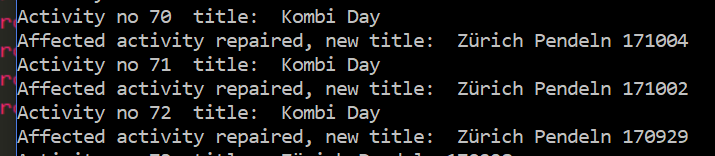

#  file renaming

A small workaround that helps to quickly rename multiple activities on Strava.

## Functions
If you want to rename many Strava activities at once, this tool can help you. Renaming can be useful if you want to run post-hoc analysis, use other Strava web apps like [Veloviewer](http://veloviewer.com/) or [Strafforts](https://github.com/yizeng/strafforts), or just like clean data. 
After providing your Strava credentials, the tool iterates over all your activities and gives your new name to all files that fulfill your prespecified conditions. There are 3 modi which you can enter by using the following flags:
* `--private` &nbsp;&nbsp;&nbsp;&nbsp;&nbsp;&nbsp; Using this mode, you can rename all your private activities.
* `--commute` &nbsp;&nbsp;&nbsp;&nbsp;&nbsp;&nbsp; Renames all commuting rides. **Sorry: Does not work atm, Strava source is inconsistent here, pls contribute.** 
* `--string` &nbsp;&nbsp;&nbsp;&nbsp;&nbsp;&nbsp;&nbsp;&nbsp; In this mode, all activities whose titles contain a string you can specify, are renamed. 

Please use one of these flags only. Default mode is `--string`. If your new name is e.g. *Zürich commuting*, then the tool will append the day in reversed order such that activities with the same name sorted in ascending order by date.  In addition you can specify that you only want to rename `N` ride with a second flag. By default all your activities are verified (takes several minutes if you have 100+ activities). 

## Requirements

* Python 3.x
* Selenium library for Python (use `pip install selenium` and then [download the geckodriver for your OS](https://github.com/mozilla/geckodriver/releases). If you have a Win64 OS, you get the driver automatically by cloning this repo.)
* Firefox (Selenium can easily used for other browsers, but code is optimized for Firefox)

## Disclaimer
I am not a professional programmer, but I like exploring python libraries and this is my first application making use of the selenium library, a browser automation framework. Feel free to fork and please open issues if you find bugs.

